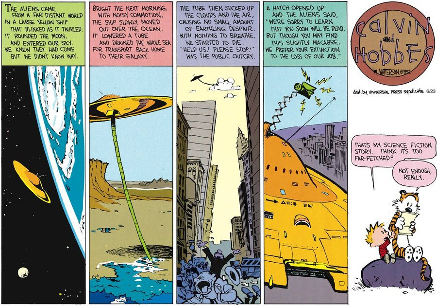

# Speculating Futures

_Speculating Futures_ looks at past speculative narratives, like those of Ursula K. Le Guin, and past attempts at creating technological utopia, like Chile's Cybersyn. These readings examine the shortcomings that prevented these visions from being fully realized and how they may have been limited or exclusionary. These texts also tie these visions to the contemporary issues that need to be addressed in subsequent utopian imaginaries. The goal is to envision our own utopian futures, which consequently involve reimagining current circumstances, and write about and prototype the technologies that undergird them.

This syllabus will probably never be complete; it's always open to suggestions. If you're familiar with GitHub, please don't hesitate to submit a pull request; if not, [feel free to send suggestions to me on Twitter (@frnsys)](https://twitter.com/frnsys).

[You can view the web version here.](http://speculatingfutures.club)

---

---

_NB: Beyond session 1, these sessions aren't in any particular order. There's so much overlap and interaction between these topics that you can jump around as much as you want; the "session" structure is more of a loose guide. Reading "out of order" could lead to interesting connections~_

- Session 1: What do we have to look forward to? A whirlwind tour of the imagined and present dystopia
    - "The future is here, it's just unevenly distributed" - William Gibson
    - [When the Messiah Came to America, She Was a Woman](https://blog.longreads.com/2016/02/25/when-the-messiah-came-to-america-she-was-a-woman/). Chris Jennings.
    - [Why Futurism Has a Cultural Blindspot](http://nautil.us/issue/28/2050/why-futurism-has-a-cultural-blindspot). Tom Vanderbilt.
    - [The Unexotic Underclass](https://miter.mit.edu/the-unexotic-underclass/). C.Z. Nnaemeka.
    - [Make technological utopia easier with this one weird trick](http://futurismic.com/2014/10/12/make-technological-utopia-easier-with-this-one-weird-trick/). Paul Raven.
    - [Social Science Fiction](http://www.peterfrase.com/2010/12/social-science-fiction/). Peter Frase.
    - [A Non-Euclidean View of California as a Cold Place to Be](http://theanarchistlibrary.org/library/ursula-k-le-guin-a-non-euclidean-view-of-california-as-a-cold-place-to-be). Ursula K. Le Guin.
    - [Postcards from the Futch](https://medium.com/message/postcards-from-the-futch-595796d8a45d#.7x8g0skdj). Joanne McNeil.
    - [Optimists’ Creed: Brave New Cyberlearning, Evolving Utopias (Circa 2041)](http://link.springer.com/article/10.1007/s40593-016-0096-x). Winslow Burleson, Armanda Lewis.
    - [Free love or genocide? The trouble with Utopias](http://www.theguardian.com/books/2016/jan/24/trouble-with-utopia-free-love-genocide-thomas-more-500-exhibition). Tobias Jones.
    - [Every Single Word Spoken by a Person of Color in "Her"](https://www.youtube.com/watch?v=wy_z_KKClBE). Edited by Dylan Marron.
    - [The Future Mundane](http://www.core77.com/posts/25678/the-future-mundane-25678). Nick Foster.
    - [The Propaganda of the Colony](http://metropolarity.net/2016/09/style-of-attack-report/). Eighteen & Ras, from Metropolarity's _Style of Attack Report_.

- Session 2: The Illusive Utopia: Cultural Hegemony & Ideology
    - [In the Name of Love](https://www.jacobinmag.com/2014/01/in-the-name-of-love/). Miya Tokumitsu.
    - ["Sharing" Economy and Self-Exploitation](http://thenewinquiry.com/blogs/marginal-utility/sharing-economy-and-self-exploitation/). Rob Horning.

- Session 3: Post-Bit: Gender & Sexuality
    - [Why Aren't There More Women Futurists?](http://www.theatlantic.com/technology/archive/2015/07/futurism-sexism-men/400097/) Rose Eveleth.
    - [La conciencia de la mestiza (Towards a New Consciousness)](https://sites.oxy.edu/ron/msi/05/texts/anzaldua-mestizaconsciousness.pdf). Gloria Anzaldúa.
    - [A Cyborg Manifesto](http://faculty.georgetown.edu/irvinem/theory/Haraway-CyborgManifesto-1.pdf). Donna Haraway.
    - [Xenofeminism: A Politics for Alienation](http://www.laboriacuboniks.net/). Laboria Cuboniks.
    - [The Matter of Seggri](http://poliscifi.pbworks.com/f/leguin.pdf). Ursula K. Le Guin.
    - [Aye, and Gomorrah...](http://strangehorizons.com/2015/20151123/2delany-f.shtml). Samuel R. Delany.
    - [So far we have discovered fourteen genders](https://twitter.com/MicroSFF/status/720991032079462401). @MicroSFF.
    - [Technically, a Utopia](http://bookforum.com/inprint/022_05/15583). Sarah Leonard.

- Session 4: How it's Made: Neocolonialism
    - [Postcapitalist Ecology: A Comment on Inventing the Future](http://thedisorderofthings.com/2015/11/04/postcapitalist-ecology-a-comment-on-inventing-the-future/). Joseph Kay.
    - [E-waste Republic](http://interactive.aljazeera.com/aje/2015/ewaste/index.html). Jacopo Ottaviani & Isacco Chiaf.
    - [Beyond “Conflict Minerals”: The Congo’s Resource Curse Lives On](https://www.dissentmagazine.org/article/beyond-conflict-minerals-the-congos-resource-curse-lives-on). Colin Kinniburgh.
    - [The Laborers Who Keep Dick Pics and Beheadings Out of Your Facebook Feed](http://www.wired.com/2014/10/content-moderation). Adrian Chen.
    - [1 Million Workers. 90 Million iPhones. 17 Suicides. Who’s to Blame?](http://www.wired.com/2011/02/ff_joelinchina/). Joel Johnson.
    - [In China, Human Costs Are Built Into an iPad](http://www.nytimes.com/2012/01/26/business/ieconomy-apples-ipad-and-the-human-costs-for-workers-in-china.html). Charles Duhigg and David Barboza.
    - [Congratulations, We’re Moving Your Department to Tennessee](https://backchannel.com/those-entry-level-startup-jobs-they-re-now-mostly-dead-ends-in-the-boondocks-af3b4066f5dd#.gmwwi6lh0). Lauren Smiley.
    - [The Ones Who Walk Away From Omelas](http://engl210-deykute.wikispaces.umb.edu/file/view/omelas.pdf). Ursula K. Le Guin.
    - [The Dystopian Lake Filled by the World's Tech Lust](http://www.bbc.com/future/story/20150402-the-worst-place-on-earth). Tim Maughan.
    - [The Price of the Paperless Revolution](http://www.vqronline.org/editors-desk/price-paperless-revolution). Ted Genoways.

- Session 5: The Visible Hand: Economies & Infrastructure
    - [The Cybersyn Revolution](https://www.jacobinmag.com/2015/04/allende-chile-beer-medina-cybersyn/). Eden Medina.
    - [Big Data Lessons from Our Cybernetic Past](https://www.youtube.com/watch?v=9qKoaQo9GTw&feature=youtu.be). Eden Medina.
    - [Red plenty: lessons from the Soviet dream](http://www.theguardian.com/books/2010/aug/07/red-plenty-francis-spufford-ussr). Francis Spufford.
    - [What Wal-Mart Knows About Customers' Habits](http://www.nytimes.com/2004/11/14/business/yourmoney/what-walmart-knows-about-customers-habits.html). Constance L. Hays.
    - [A Few Notes on the Culture](http://www.vavatch.co.uk/books/banks/cultnote.htm). Iain M Banks.
    - [How Far to AI-topia?](http://www.milesbrundage.com/blog-posts/how-far-to-ai-topia). Miles Brundage.

- Session 6: Synthetic Freedom: The Post-Work Society
    - [Justice for “Data Janitors”](http://www.publicbooks.org//nonfiction/justice-for-data-janitors). Lilly Irani.
    - [The Dialectic of Technology](https://www.jacobinmag.com/2012/02/the-dialectic-of-technology/). Peter Frase.
    - [The Workers Who Bring You Black Friday](http://www.thenation.com/article/holiday-crush/). Gabriel Thompson.
    - [Inventing the Future (Review)](http://www.publicseminar.org/2015/10/inventing-the-future/). McKenzie Wark.
    - [Utopia, Artificial Intelligence, and the Future of Justice](http://www.milesbrundage.com/uploads/2/1/6/8/21681226/utopiapaperai.pdf). Miles Brundage.
    - [A Basic Income for All](http://bostonreview.net/archives/BR25.5/vanparijs.html). Philippe Van Parijs.

- Session 7: A Sense of Belonging: The State, Violence, & Property
    - [Welcome to Life: the singularity, ruined by lawyers](https://www.youtube.com/watch?v=IFe9wiDfb0E). Tom Scott.
    - [Four Futures](https://www.jacobinmag.com/2011/12/four-futures/). Peter Frase.
    - [Seeing Like A State](https://libcom.org/files/Seeing%20Like%20a%20State%20-%20James%20C.%20Scott.pdf) (Chapter 1). James C. Scott.
    - [How intellectual property rules help the rich and hurt the poor](http://www.pbs.org/newshour/making-sense/column-intellectual-property-rules-help-the-rich/). Dean Baker.
    - [Why Dakota Is the New Keystone](http://www.nytimes.com/2016/10/29/opinion/why-dakota-is-the-new-keystone.html?_r=0). Bill McKibben.
    - [The War on Drugs is an Epic Fail](http://www.nytimes.com/video/opinion/100000004642370/jay-z-the-war-on-drugs-is-an-epic-fail.html). Jay Z, Molly Crabapple, Jim Batt, Kim Boekbinder and dream hampton.
    - [This is what it will be like to protest in 2020, when the state is watching your every move](http://fusion.net/story/362575/protest-2020-future-surveillance-activism-police/). Peter Moskowitz.
    - [The Making of the American Police State](https://www.jacobinmag.com/2015/07/incarceration-capitalism-black-lives-matter/). Christian Parenti.

- Session 8: We Aren't the World: Postwestern Society & Race
    - [Tongtong's Summer](http://clarkesworldmagazine.com/xia_12_14_reprint/). Xia Jia (translated by Ken Liu).
    - [The End of Days Is Coming — Just Not to China](https://foreignpolicy.com/2016/07/29/the-end-of-days-is-coming-just-not-to-china-apocalyptic-fiction-movies/). Isaac Stone Fish.
    - [Visual Cultures of Indigenous Futurisms](http://gutsmagazine.ca/featured/visual-cultures). Lindsay Nixon.
    - [Ethnic Futurism in the Gulf](http://thesigers.com/analysis/2013/7/31/ethnic-futurism-in-the-gulf.html). Scott Smith & Rahel Aima.
    - [The Space NDN’s Star Map](http://thenewinquiry.com/essays/the-space-ndns-star-map/). Lou Catherine Cornum.
    - [Towards Arabfuturism/s](http://www.noveltymag.co.uk/towards-arabfuturisms/). Sulaiman Majali.
    - [Afrofuturism and Arabfuturism: Reflections of a Present-day Diasporic Reader](http://tohumagazine.com/article/afrofuturism-and-arabfuturism-reflections-present-day-diasporic-reader). Lama Suleiman.
    - [The Afronauts](https://theawl.com/the-afronauts-d429ebd9a677#.u9lt149ly). Adwoa Afful & Frances Bodomo.

- Session 9: Made of Meat: Bodies & Biology
    - [Lilith's Brood](https://en.wikipedia.org/wiki/Lilith's_Brood). Octavia E. Butler.
    - [Utopian Possibilities: Disability, Norms, and Eugenics in Octavia Butler's Xenogenesis](http://online.liverpooluniversitypress.co.uk/doi/abs/10.3828/jlcds.2015.2). Claire Curtis.
    - [Rebooting humanity through disability](https://dishuman.com/2015/02/02/rebooting-humanity-through-disability/). Dan Goodley.
    - [Crip Utopia and the Future of Disability](http://cdd.journals.yorku.ca/index.php/cdd/article/download/23383/21615). Peter J. Mackey.
    - [GynePunk, the cyborg witches of DIY gynecology](http://www.makery.info/en/2016/06/30/gynepunk-les-sorcieres-cyborg-de-la-gynecologie-diy/). Ewen Chardronnet.

- Session 10: Chaff: Internet & (Social) Media
    - [Cyber-Utopianism](http://crowdsociety.org/index.php?title=Cyber-utopianism&oldid=4608)
    - [An Accelerated Grimace: On Cyber-Utopianism](https://www.thenation.com/article/accelerated-grimace-cyber-utopianism/). Chris Lehmann.
    - [SPOOKS](http://www.amazon.com/SPOOKS-dystopia-E-M-Quangel-ebook/dp/B00QL15GH4). EM Quangel
    - [Communicative Capitalism: Circulation and the Foreclosure of Politics](https://commonconf.files.wordpress.com/2010/09/proofs-of-tech-fetish.pdf). Jodi Dean.

- Session 11: All We Have: Environment & Ecology
    - [Alive in the Sunshine](https://www.jacobinmag.com/2014/01/alive-in-the-sunshine/). Alyssa Battistoni.
    - [Samsung's Galaxy Note 7 Recall is an Environmental Travesty](http://motherboard.vice.com/read/galaxy-note-7-explosion-environmental-impact-recycling). Jason Koebler.
    - [The New Utopians](https://newrepublic.com/article/123217/new-utopians). Jeet Heer.
    - [Solarpunk wants to save the world](http://www.hopesandfears.com/hopes/city/life/215749-solarpunk). Ben Valentine & Vincent Callebaut.

- Session 12: The Come Down
    - [Everything is Broken](https://medium.com/message/everything-is-broken-81e5f33a24e1#.oef7thyw0). Quinn Norton.
    - [Fully automated luxury communism: a utopian critique](https://libcom.org/blog/fully-automated-luxury-communism-utopian-critique-14062015). mcm\_cmc.
    - [The Dispossessed: An Ambiguous Utopia](https://en.wikipedia.org/wiki/The_Dispossessed). Ursula K. Le Guin.

---

The following were taken from Allison Burtch's [Critical Theory of Technology](https://github.com/allisonburtch/Critical-Theory-of-Technology):

- [Communicative Capitalism: Circulation and the Foreclosure of Politics](https://commonconf.files.wordpress.com/2010/09/proofs-of-tech-fetish.pdf). Jodi Dean.
- [A Non-Euclidean View of California as a Cold Place to Be](http://theanarchistlibrary.org/library/ursula-k-le-guin-a-non-euclidean-view-of-california-as-a-cold-place-to-be). Ursula K. Le Guin.

The following were taken from Chris Novello's [Computer Utopias](http://chrisnovello.com/teaching/risd/computer-utopias/):

- [Every Single Word Spoken by a Person of Color in "Her"](https://www.youtube.com/watch?v=wy_z_KKClBE). Edited by Dylan Marron.
- [The Future Mundane](http://www.core77.com/posts/25678/the-future-mundane-25678). Nick Foster.

The following were taken from Matthew Hockenberry's [Supply Studies Syllabus](https://supplystudies.com/syllabus/):

- [The Dystopian Lake Filled by the World's Tech Lust](http://www.bbc.com/future/story/20150402-the-worst-place-on-earth). Tim Maughan.
- [In China, Human Costs Are Built Into an iPad](http://www.nytimes.com/2012/01/26/business/ieconomy-apples-ipad-and-the-human-costs-for-workers-in-china.html). Charles Duhigg and David Barboza.
- [The Price of the Paperless Revolution](http://www.vqronline.org/editors-desk/price-paperless-revolution). Ted Genoways.

---

I ended up removing this session since I couldn't quite get it to fit, but maybe it will have its place later, so here it is:

- Sapir-Whorf: Language
    - [Shaka, When the Walls Fell](http://www.theatlantic.com/entertainment/archive/2014/06/star-trek-tng-and-the-limits-of-language-shaka-when-the-walls-fell/372107/). Ian Bogost. (watch the episode too)
    - [Walls of the Tongue: A Sociolinguistic Analysis of Ursula K. Le Guin's _The Dispossessed_](http://linguistics.berkeley.edu/~dwbruhn/dwbruhn_376_Dispossessed.pdf). Daniel W. Bruhn.

---

This syllabus isn't about science fiction per se, but there's definitely a lot of overlap...here are science fiction books that I've enjoyed or that were suggested by others:

- Trouble on Triton. Samuel R. Delany.
- The Left Hand of Darkness. Ursula K. Le Guin.
- China Mountain Zhang. Maureen F. McHugh.
- Down and Out in the Magic Kingdom. Cory Doctorow.
- Martian Chronicles. Ray Bradbury.
- Stranger in a Strange Land. Robert A. Heinlein.
- Never Let Me Go. Kazuo Ishiguro.
- Green Earth. Kim Stanley Robinson.
- For Us, The Living: A Comedy of Customs. Robert A. Heinlein.
- Ecotopia. Ernest Callenbach.
- Embassytown. China Miéville.
- The Sandman. ETA Hoffmann.
- The Handmaid's Tale. Margaret Atwood.

Another [list of recommend science fiction is maintained here](https://docs.google.com/document/d/13-nu88sfg0mDgbpKyJHpU6Q7tK9PJTTScaaOyeGplqM/edit).
